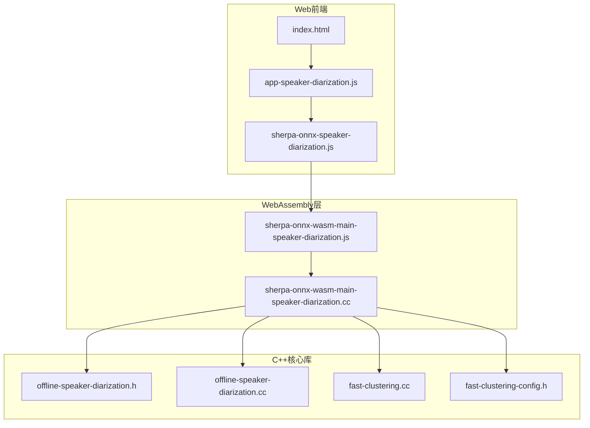
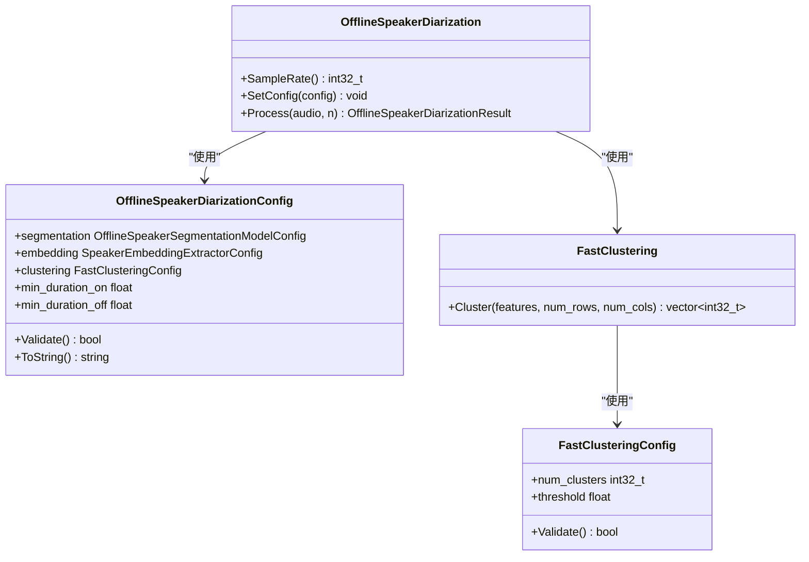
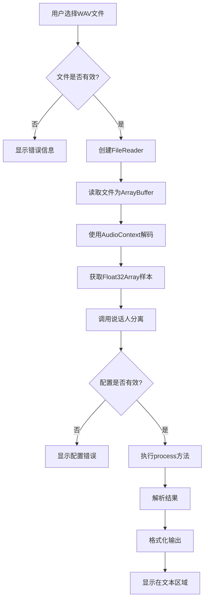
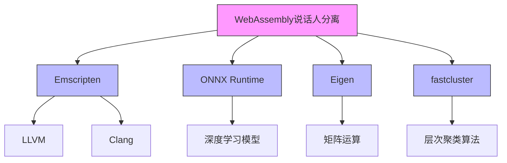
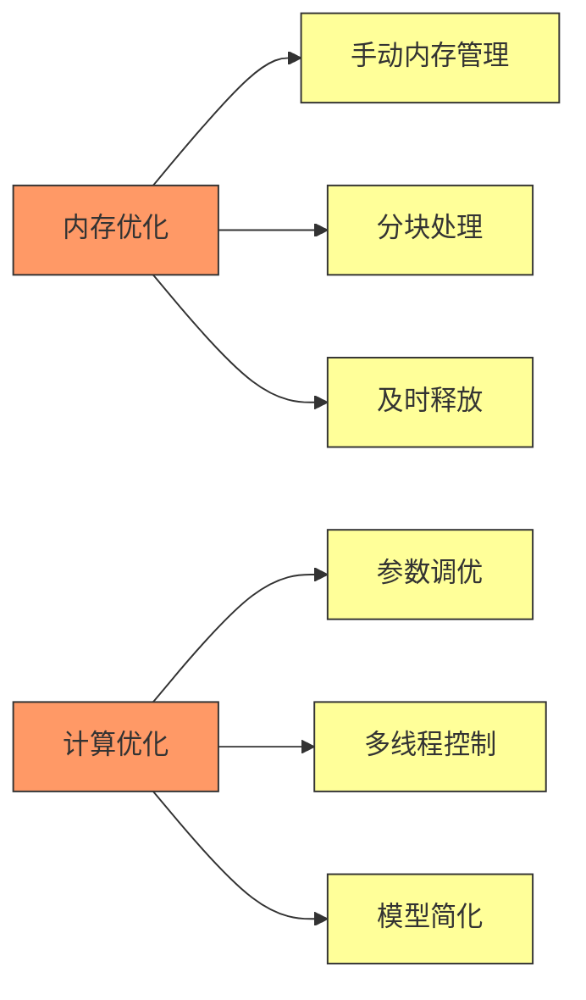
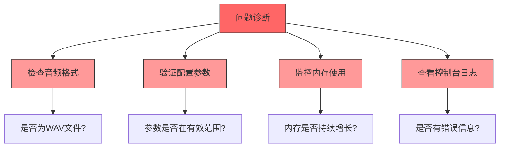

# WebAssembly 说话人分离

<cite>
**本文档引用的文件**   
- [sherpa-onnx-wasm-main-speaker-diarization.cc](file://wasm/speaker-diarization/sherpa-onnx-wasm-main-speaker-diarization.cc)
- [sherpa-onnx-speaker-diarization.js](file://wasm/speaker-diarization/sherpa-onnx-speaker-diarization.js)
- [app-speaker-diarization.js](file://wasm/speaker-diarization/app-speaker-diarization.js)
- [index.html](file://wasm/speaker-diarization/index.html)
- [offline-speaker-diarization.h](file://sherpa-onnx/csrc/offline-speaker-diarization.h)
- [offline-speaker-diarization.cc](file://sherpa-onnx/csrc/offline-speaker-diarization.cc)
- [fast-clustering.cc](file://sherpa-onnx/csrc/fast-clustering.cc)
- [fast-clustering-config.h](file://sherpa-onnx/csrc/fast-clustering-config.h)
</cite>

## 目录
1. [引言](#引言)
2. [项目结构](#项目结构)
3. [核心组件](#核心组件)
4. [架构概述](#架构概述)
5. [详细组件分析](#详细组件分析)
6. [依赖分析](#依赖分析)
7. [性能考虑](#性能考虑)
8. [故障排除指南](#故障排除指南)
9. [结论](#结论)

## 引言
WebAssembly 说话人分离技术是现代语音处理领域的重要突破，它允许在浏览器环境中高效执行复杂的语音分析任务。本技术文档深入解析了基于WebAssembly的说话人分离功能，重点分析了C++核心算法实现和JavaScript绑定层的设计。该系统通过将高性能的C++语音处理代码编译为WebAssembly模块，实现了在Web环境中对多说话人音频流的实时处理能力。系统采用分阶段处理流程：首先通过语音分割模型识别语音活动区域，然后提取说话人嵌入特征，最后使用快速聚类算法将相似的语音片段归为同一说话人。这种架构不仅保证了处理精度，还通过WebAssembly的沙箱机制确保了浏览器环境的安全性。

## 项目结构
WebAssembly说话人分离功能的实现分布在多个关键文件中，形成了清晰的分层架构。核心算法由C++编写，通过Emscripten编译为WebAssembly模块，而JavaScript层则负责与Web环境的交互和用户界面集成。



**图源**
- [index.html](file://wasm/speaker-diarization/index.html)
- [app-speaker-diarization.js](file://wasm/speaker-diarization/app-speaker-diarization.js)
- [sherpa-onnx-speaker-diarization.js](file://wasm/speaker-diarization/sherpa-onnx-speaker-diarization.js)
- [sherpa-onnx-wasm-main-speaker-diarization.cc](file://wasm/speaker-diarization/sherpa-onnx-wasm-main-speaker-diarization.cc)
- [offline-speaker-diarization.h](file://sherpa-onnx/csrc/offline-speaker-diarization.h)
- [offline-speaker-diarization.cc](file://sherpa-onnx/csrc/offline-speaker-diarization.cc)
- [fast-clustering.cc](file://sherpa-onnx/csrc/fast-clustering.cc)
- [fast-clustering-config.h](file://sherpa-onnx/csrc/fast-clustering-config.h)

**本节来源**
- [index.html](file://wasm/speaker-diarization/index.html)
- [app-speaker-diarization.js](file://wasm/speaker-diarization/app-speaker-diarization.js)
- [sherpa-onnx-speaker-diarization.js](file://wasm/speaker-diarization/sherpa-onnx-speaker-diarization.js)
- [sherpa-onnx-wasm-main-speaker-diarization.cc](file://wasm/speaker-diarization/sherpa-onnx-wasm-main-speaker-diarization.cc)

## 核心组件
WebAssembly说话人分离系统的核心组件包括C++实现的说话人分离算法、JavaScript绑定层和Web前端集成。C++核心文件`sherpa-onnx-wasm-main-speaker-diarization.cc`定义了与WebAssembly交互的C接口，通过`extern "C"`声明确保C++函数能够被JavaScript正确调用。该文件中的`MyPrint`函数用于调试配置参数，而`CopyHeap`函数则用于在堆内存间复制数据。JavaScript绑定文件`sherpa-onnx-speaker-diarization.js`实现了`OfflineSpeakerDiarization`类，该类封装了WebAssembly模块的调用，提供了`process`方法用于处理音频样本。前端应用`app-speaker-diarization.js`负责用户界面交互，处理文件选择和结果显示。

**本节来源**
- [sherpa-onnx-wasm-main-speaker-diarization.cc](file://wasm/speaker-diarization/sherpa-onnx-wasm-main-speaker-diarization.cc)
- [sherpa-onnx-speaker-diarization.js](file://wasm/speaker-diarization/sherpa-onnx-speaker-diarization.js)
- [app-speaker-diarization.js](file://wasm/speaker-diarization/app-speaker-diarization.js)

## 架构概述
WebAssembly说话人分离系统的整体架构采用了分层设计，将计算密集型的语音处理任务与Web界面逻辑分离。系统通过Emscripten将C++代码编译为WebAssembly二进制文件，实现了接近原生性能的语音处理能力，同时保持了Web应用的跨平台特性。

```mermaid
sequenceDiagram
participant 用户界面 as 用户界面
participant JavaScript绑定 as JavaScript绑定
participant WebAssembly模块 as WebAssembly模块
participant C++核心库 as C++核心库
用户界面->>JavaScript绑定 : 选择音频文件
JavaScript绑定->>WebAssembly模块 : 初始化模块
WebAssembly模块->>C++核心库 : 创建说话人分离器
C++核心库-->>WebAssembly模块 : 返回句柄
WebAssembly模块-->>JavaScript绑定 : 返回实例
JavaScript绑定->>用户界面 : 显示就绪状态
用户界面->>JavaScript绑定 : 点击开始按钮
JavaScript绑定->>WebAssembly模块 : 调用process方法
WebAssembly模块->>C++核心库 : 执行说话人分离
C++核心库-->>WebAssembly模块 : 返回结果
WebAssembly模块-->>JavaScript绑定 : 解析结果
JavaScript绑定-->>用户界面 : 显示说话人标签
```

**图源**
- [sherpa-onnx-wasm-main-speaker-diarization.cc](file://wasm/speaker-diarization/sherpa-onnx-wasm-main-speaker-diarization.cc)
- [sherpa-onnx-speaker-diarization.js](file://wasm/speaker-diarization/sherpa-onnx-speaker-diarization.js)
- [app-speaker-diarization.js](file://wasm/speaker-diarization/app-speaker-diarization.js)

## 详细组件分析

### C++核心算法分析
说话人分离的核心算法在C++中实现，通过一系列精心设计的类和函数完成复杂的语音处理任务。`OfflineSpeakerDiarization`类是主要的接口类，它封装了整个说话人分离流程。该类的构造函数接收`OfflineSpeakerDiarizationConfig`配置对象，用于初始化语音分割、嵌入提取和聚类等子系统。



**图源**
- [offline-speaker-diarization.h](file://sherpa-onnx/csrc/offline-speaker-diarization.h)
- [offline-speaker-diarization.cc](file://sherpa-onnx/csrc/offline-speaker-diarization.cc)
- [fast-clustering.cc](file://sherpa-onnx/csrc/fast-clustering.cc)
- [fast-clustering-config.h](file://sherpa-onnx/csrc/fast-clustering-config.h)

**本节来源**
- [offline-speaker-diarization.h](file://sherpa-onnx/csrc/offline-speaker-diarization.h)
- [offline-speaker-diarization.cc](file://sherpa-onnx/csrc/offline-speaker-diarization.cc)

### JavaScript绑定层分析
JavaScript绑定层是连接Web前端和WebAssembly模块的桥梁，它通过精心设计的API暴露核心功能。`sherpa-onnx-speaker-diarization.js`文件中的`OfflineSpeakerDiarization`类提供了面向对象的接口，简化了WebAssembly的复杂调用。

```mermaid
sequenceDiagram
participant JavaScript as JavaScript
participant WebAssembly as WebAssembly
participant C++ as C++
JavaScript->>WebAssembly : createOfflineSpeakerDiarization()
WebAssembly->>C++ : _SherpaOnnxCreateOfflineSpeakerDiarization()
C++-->>WebAssembly : 返回句柄
WebAssembly-->>JavaScript : 返回实例
JavaScript->>WebAssembly : process(samples)
WebAssembly->>C++ : _malloc(samples.length * BYTES_PER_ELEMENT)
WebAssembly->>C++ : HEAPF32.set(samples, pointer)
WebAssembly->>C++ : _SherpaOnnxOfflineSpeakerDiarizationProcess()
C++-->>WebAssembly : 返回结果指针
WebAssembly->>C++ : _SherpaOnnxOfflineSpeakerDiarizationResultGetNumSegments()
WebAssembly->>C++ : _SherpaOnnxOfflineSpeakerDiarizationResultSortByStartTime()
WebAssembly->>C++ : HEAPF32读取数据
WebAssembly->>C++ : _free(pointer)
WebAssembly-->>JavaScript : 返回结果数组
```

**图源**
- [sherpa-onnx-speaker-diarization.js](file://wasm/speaker-diarization/sherpa-onnx-speaker-diarization.js)
- [sherpa-onnx-wasm-main-speaker-diarization.cc](file://wasm/speaker-diarization/sherpa-onnx-wasm-main-speaker-diarization.cc)

**本节来源**
- [sherpa-onnx-speaker-diarization.js](file://wasm/speaker-diarization/sherpa-onnx-speaker-diarization.js)
- [sherpa-onnx-wasm-main-speaker-diarization.cc](file://wasm/speaker-diarization/sherpa-onnx-wasm-main-speaker-diarization.cc)

### 前端集成分析
前端集成方案通过`app-speaker-diarization.js`和`index.html`文件实现，提供了完整的用户交互体验。系统采用事件驱动架构，通过HTML5的File API处理用户上传的音频文件，并使用Web Audio API进行音频解码。



**图源**
- [app-speaker-diarization.js](file://wasm/speaker-diarization/app-speaker-diarization.js)
- [index.html](file://wasm/speaker-diarization/index.html)

**本节来源**
- [app-speaker-diarization.js](file://wasm/speaker-diarization/app-speaker-diarization.js)
- [index.html](file://wasm/speaker-diarization/index.html)

## 依赖分析
WebAssembly说话人分离系统依赖于多个关键组件和库，形成了复杂的依赖关系网络。系统的核心依赖包括Emscripten工具链、ONNX Runtime、Eigen线性代数库和fastcluster聚类库。



**图源**
- [sherpa-onnx-wasm-main-speaker-diarization.cc](file://wasm/speaker-diarization/sherpa-onnx-wasm-main-speaker-diarization.cc)
- [offline-speaker-diarization.h](file://sherpa-onnx/csrc/offline-speaker-diarization.h)
- [fast-clustering.cc](file://sherpa-onnx/csrc/fast-clustering.cc)

**本节来源**
- [sherpa-onnx-wasm-main-speaker-diarization.cc](file://wasm/speaker-diarization/sherpa-onnx-wasm-main-speaker-diarization.cc)
- [offline-speaker-diarization.h](file://sherpa-onnx/csrc/offline-speaker-diarization.h)
- [fast-clustering.cc](file://sherpa-onnx/csrc/fast-clustering.cc)

## 性能考虑
大规模音频处理时的性能优化是WebAssembly说话人分离系统的关键挑战。系统通过多种策略实现内存优化和计算负载均衡，确保在浏览器环境中高效运行。

首先，内存管理采用手动分配和释放策略，通过`_malloc`和`_free`函数精确控制WebAssembly堆内存的使用。在`process`方法中，系统为音频样本分配临时内存，处理完成后立即释放，避免内存泄漏。对于大型音频文件，建议采用分块处理策略，将长音频分割为较小的片段依次处理，从而降低内存峰值使用。

计算负载方面，系统通过配置参数进行优化。`min_duration_on`和`min_duration_off`参数用于过滤短时语音段和合并短间隙，减少后续处理的数据量。聚类算法的`threshold`参数直接影响计算复杂度，较高的阈值会产生较少的聚类，从而降低计算负载。对于实时应用，可以调整`numThreads`参数来平衡多线程并行度和浏览器主线程的响应性。



**图源**
- [sherpa-onnx-speaker-diarization.js](file://wasm/speaker-diarization/sherpa-onnx-speaker-diarization.js)
- [offline-speaker-diarization.h](file://sherpa-onnx/csrc/offline-speaker-diarization.h)

## 故障排除指南
在使用WebAssembly说话人分离功能时，可能会遇到各种常见问题。本节提供诊断方法和解决方案，帮助开发者快速定位和解决问题。

音频格式问题是常见故障之一。系统要求输入音频为单声道WAV文件，采样率需与模型期望的采样率匹配。如果音频文件格式不正确，系统会抛出错误或返回空结果。解决方案是使用音频处理工具将文件转换为正确的格式。

配置参数错误是另一个常见问题。特别是`numClusters`和`threshold`参数的设置需要根据具体场景调整。如果`numClusters`设置为-1，则必须提供有效的`threshold`值。调试时可以使用`MyPrint`函数输出配置参数，验证设置是否正确。

内存相关错误通常表现为浏览器崩溃或"out of memory"异常。这可能是由于处理过长的音频文件导致。建议对超过5分钟的音频进行分段处理，或在`Module`配置中增加内存限制。



**图源**
- [app-speaker-diarization.js](file://wasm/speaker-diarization/app-speaker-diarization.js)
- [sherpa-onnx-wasm-main-speaker-diarization.cc](file://wasm/speaker-diarization/sherpa-onnx-wasm-main-speaker-diarization.cc)

**本节来源**
- [app-speaker-diarization.js](file://wasm/speaker-diarization/app-speaker-diarization.js)
- [sherpa-onnx-wasm-main-speaker-diarization.cc](file://wasm/speaker-diarization/sherpa-onnx-wasm-main-speaker-diarization.cc)

## 结论
WebAssembly说话人分离技术为浏览器环境中的语音处理提供了强大的解决方案。通过将高性能的C++算法编译为WebAssembly模块，系统实现了接近原生性能的说话人分离能力，同时保持了Web应用的跨平台特性和安全性。核心算法采用三阶段处理流程：语音分割、特征提取和聚类分析，确保了高精度的说话人识别。JavaScript绑定层提供了简洁的API接口，简化了Web集成的复杂性。前端实现展示了完整的用户交互流程，从文件上传到结果展示。性能优化策略和故障排除指南为实际应用提供了实用的指导。未来发展方向包括支持流式处理、提高实时性能和扩展多语言支持，进一步提升系统的实用性和适用范围。