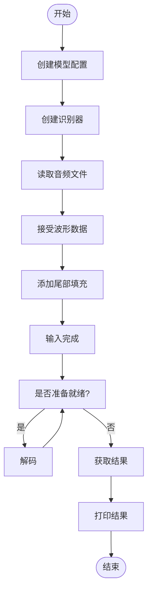

# 示例代码

<cite>
**本文档中引用的文件**   
- [README.md](file://README.md)
- [c-api-examples/decode-file-c-api.c](file://c-api-examples/decode-file-c-api.c)
- [c-api-examples/README.md](file://c-api-examples/README.md)
- [python-api-examples/offline-tts.py](file://python-api-examples/offline-tts.py)
- [python-api-examples/README.md](file://python-api-examples/README.md)
- [java-api-examples/README.md](file://java-api-examples/README.md)
- [java-api-examples/NonStreamingDecodeFileWhisper.java](file://java-api-examples/NonStreamingDecodeFileWhisper.java)
- [go-api-examples/README.md](file://go-api-examples/README.md)
- [go-api-examples/non-streaming-tts/main.go](file://go-api-examples/non-streaming-tts/main.go)
- [swift-api-examples/decode-file.swift](file://swift-api-examples/decode-file.swift)
- [kotlin-api-examples/test_offline_asr.kt](file://kotlin-api-examples/test_offline_asr.kt)
- [nodejs-examples/test-offline-whisper.js](file://nodejs-examples/test-offline-whisper.js)
- [dotnet-examples/non-streaming-canary-decode-files/Program.cs](file://dotnet-examples/non-streaming-canary-decode-files/Program.cs)
</cite>

## 目录
1. [简介](#简介)
2. [功能分类](#功能分类)
3. [API示例](#api示例)
4. [运行示例步骤](#运行示例步骤)
5. [常见问题解决方案](#常见问题解决方案)

## 简介

sherpa-onnx是一个支持多种功能的本地语音处理库，包括语音识别（ASR）、文本转语音（TTS）、说话人分离、说话人识别、语音语言识别、音频标记、语音活动检测（VAD）、关键词检测、语音增强和源分离等。该项目支持在多种平台和操作系统上运行，包括x86、x86_64、ARM32/64、RISC-V等架构，以及Linux、macOS、Windows、Android、iOS和HarmonyOS等操作系统。

该项目支持多种编程语言的API，包括C++、C、Python、Go、C#、Java、Kotlin、JavaScript、Swift、Rust、Dart和Object Pascal，并且还支持WebAssembly。用户可以通过Huggingface Spaces在线体验sherpa-onnx的功能，无需安装任何软件。

**Section sources**
- [README.md](file://README.md#L1-L590)

## 功能分类

sherpa-onnx的示例代码按功能可分为以下几类：

### 语音识别（ASR）示例
语音识别示例展示了如何使用不同的模型进行语音到文本的转换，包括流式和非流式模型。支持的模型包括Zipformer、Paraformer、Whisper、SenseVoice等。

### 文本转语音（TTS）示例
文本转语音示例展示了如何将文本转换为自然语音，支持多种TTS模型如VITS、Matcha、Kokoro、Kitten等。

### 说话人分离（Speaker Diarization）示例
说话人分离示例展示了如何识别音频中不同说话人的语音段落。

### 说话人识别（Speaker Identification）示例
说话人识别示例展示了如何识别说话人的身份。

### 语音语言识别（Spoken Language Identification）示例
语音语言识别示例展示了如何识别语音中的语言种类。

### 音频标记（Audio Tagging）示例
音频标记示例展示了如何为音频片段添加标签，识别其中的声音事件。

### 语音活动检测（VAD）示例
语音活动检测示例展示了如何检测语音信号中的语音活动部分。

### 关键词检测（Keyword Spotting）示例
关键词检测示例展示了如何在语音流中检测特定关键词。

### 语音增强（Speech Enhancement）示例
语音增强示例展示了如何改善语音质量，去除噪声。

### 源分离（Source Separation）示例
源分离示例展示了如何将混合音频分离成不同的音源。

**Section sources**
- [README.md](file://README.md#L1-L590)

## API示例

### C API示例
C API示例位于`c-api-examples`目录中，展示了如何使用C语言接口进行语音处理。例如，`decode-file-c-api.c`文件展示了如何使用流式转换器模型解码音频文件。

**Diagram sources**
- [c-api-examples/decode-file-c-api.c](file://c-api-examples/decode-file-c-api.c#L92-L244)

**Section sources**
- [c-api-examples/decode-file-c-api.c](file://c-api-examples/decode-file-c-api.c#L1-L245)
- [c-api-examples/README.md](file://c-api-examples/README.md#L1-L19)

### Python API示例
Python API示例位于`python-api-examples`目录中，提供了丰富的脚本用于各种语音处理任务。例如，`offline-tts.py`文件展示了如何使用非流式TTS模型生成语音。

**Diagram sources**
- [python-api-examples/offline-tts.py](file://python-api-examples/offline-tts.py#L380-L450)

**Section sources**
- [python-api-examples/offline-tts.py](file://python-api-examples/offline-tts.py#L1-L451)
- [python-api-examples/README.md](file://python-api-examples/README.md#L1-L13)

### Java API示例
Java API示例位于`java-api-examples`目录中，展示了如何使用Java接口进行语音处理。例如，`NonStreamingDecodeFileWhisper.java`文件展示了如何使用离线Whisper模型解码音频文件。

**Diagram sources**
- [java-api-examples/NonStreamingDecodeFileWhisper.java](file://java-api-examples/NonStreamingDecodeFileWhisper.java#L8-L50)

**Section sources**
- [java-api-examples/NonStreamingDecodeFileWhisper.java](file://java-api-examples/NonStreamingDecodeFileWhisper.java#L1-L51)
- [java-api-examples/README.md](file://java-api-examples/README.md#L1-L142)

### Go API示例
Go API示例位于`go-api-examples`目录中，展示了如何使用Go语言接口进行语音处理。例如，`non-streaming-tts/main.go`文件展示了如何使用非流式TTS模型生成语音。

**Diagram sources**
- [go-api-examples/non-streaming-tts/main.go](file://go-api-examples/non-streaming-tts/main.go#L11-L122)

**Section sources**
- [go-api-examples/non-streaming-tts/main.go](file://go-api-examples/non-streaming-tts/main.go#L1-L122)
- [go-api-examples/README.md](file://go-api-examples/README.md#L1-L47)

### Swift API示例
Swift API示例位于`swift-api-examples`目录中，展示了如何使用Swift语言接口进行语音处理。例如，`decode-file.swift`文件展示了如何使用在线识别器解码音频文件。

**Diagram sources**
- [swift-api-examples/decode-file.swift](file://swift-api-examples/decode-file.swift#L15-L103)

**Section sources**
- [swift-api-examples/decode-file.swift](file://swift-api-examples/decode-file.swift#L1-L103)

### Kotlin API示例
Kotlin API示例位于`kotlin-api-examples`目录中，展示了如何使用Kotlin语言接口进行语音处理。例如，`test_offline_asr.kt`文件展示了如何测试不同类型的离线语音识别。

**Diagram sources**
- [kotlin-api-examples/test_offline_asr.kt](file://kotlin-api-examples/test_offline_asr.kt#L3-L51)

**Section sources**
- [kotlin-api-examples/test_offline_asr.kt](file://kotlin-api-examples/test_offline_asr.kt#L1-L51)

### Node.js API示例
Node.js API示例位于`nodejs-examples`目录中，展示了如何使用JavaScript接口进行语音处理。例如，`test-offline-whisper.js`文件展示了如何使用离线Whisper模型进行语音识别。

**Diagram sources**
- [nodejs-examples/test-offline-whisper.js](file://nodejs-examples/test-offline-whisper.js#L8-L40)

**Section sources**
- [nodejs-examples/test-offline-whisper.js](file://nodejs-examples/test-offline-whisper.js#L1-L40)

### .NET API示例
.NET API示例位于`dotnet-examples`目录中，展示了如何使用C#语言接口进行语音处理。例如，`non-streaming-canary-decode-files/Program.cs`文件展示了如何使用NeMo Canary模型进行语音识别。

**Diagram sources**
- [dotnet-examples/non-streaming-canary-decode-files/Program.cs](file://dotnet-examples/non-streaming-canary-decode-files/Program.cs#L11-L45)

**Section sources**
- [dotnet-examples/non-streaming-canary-decode-files/Program.cs](file://dotnet-examples/non-streaming-canary-decode-files/Program.cs#L1-L45)

## 运行示例步骤

要运行sherpa-onnx的示例代码，请按照以下步骤操作：

1. **安装依赖**：根据所使用的编程语言安装相应的依赖包。例如，对于Python示例，需要安装`sherpa-onnx`包；对于Go示例，需要安装`github.com/k2-fsa/sherpa-onnx-go/sherpa_onnx`包。

2. **下载模型**：从GitHub Releases或其他指定位置下载所需的模型文件。模型文件通常包括模型权重、令牌文件和词汇表等。

3. **准备音频文件**：准备要处理的音频文件，确保其格式（如WAV）和采样率符合模型要求。

4. **配置参数**：根据示例代码的要求，设置相应的参数，如模型路径、音频文件路径、输出文件路径等。

5. **运行示例**：执行示例代码，观察输出结果。可以使用命令行或IDE来运行代码。

6. **验证结果**：检查生成的输出是否符合预期，如有问题可参考常见问题解决方案进行排查。

**Section sources**
- [README.md](file://README.md#L1-L590)

## 常见问题解决方案

在使用sherpa-onnx示例代码时，可能会遇到一些常见问题。以下是一些解决方案：

### 模型加载失败
如果出现模型加载失败的问题，请检查模型文件路径是否正确，模型文件是否完整下载，以及模型文件格式是否与API版本兼容。

### 音频格式不支持
确保音频文件格式为WAV，并且采样率和声道数符合模型要求。可以使用音频处理工具转换音频格式。

### 内存不足
对于大型模型，可能需要较多内存。可以尝试减少批处理大小，或在具有更多内存的设备上运行。

### 性能问题
如果处理速度较慢，可以尝试使用GPU或其他加速器，或调整模型参数以提高效率。

### 语言支持问题
确保使用的模型支持所需的语言。某些模型可能只支持特定语言或语言组合。

### 编译错误
对于C/C++示例，确保已正确安装编译工具链和依赖库。检查编译选项和链接库是否正确。

**Section sources**
- [README.md](file://README.md#L1-L590)