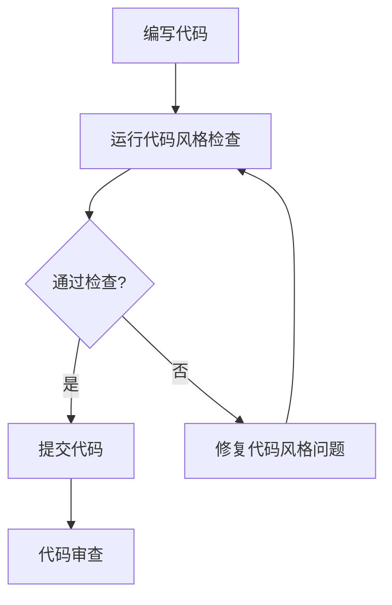

# 贡献指南

<cite>
**本文档中引用的文件**   
- [README.md](file://README.md)
- [CMakeLists.txt](file://CMakeLists.txt)
- [scripts/check_style_cpplint.sh](file://scripts/check_style_cpplint.sh)
- [.clang-format](file://.clang-format)
- [.clang-tidy](file://.clang-tidy)
- [CPPLINT.cfg](file://CPPLINT.cfg)
</cite>

## 目录
1. [简介](#简介)
2. [开发环境设置](#开发环境设置)
3. [代码贡献](#代码贡献)
4. [文档改进](#文档改进)
5. [问题报告](#问题报告)
6. [功能建议](#功能建议)
7. [代码风格指南](#代码风格指南)
8. [测试要求](#测试要求)
9. [提交流程](#提交流程)
10. [版本控制策略](#版本控制策略)
11. [发布周期](#发布周期)
12. [社区讨论与代码审查](#社区讨论与代码审查)
13. [新贡献者指引](#新贡献者指引)

## 简介

sherpa-onnx 是一个支持本地运行语音识别、语音合成、说话人分离等多种语音处理功能的开源项目。本贡献指南旨在为开发者提供详细的贡献说明，包括如何为项目做出代码贡献、改进文档、报告问题和提出功能建议。项目支持多种编程语言和平台，包括 C++、C、Python、Go、Java、C#、Kotlin、Swift、Dart、Rust、Pascal 等，以及 WebAssembly。

项目鼓励社区成员积极参与，通过贡献代码、文档、测试用例等方式共同推动项目发展。无论您是经验丰富的开发者还是刚入门的新手，都可以在本项目中找到适合自己的贡献方式。

**Section sources**
- [README.md](file://README.md#L1-L590)

## 开发环境设置

要开始为 sherpa-onnx 项目贡献代码，首先需要设置开发环境。项目使用 CMake 作为构建系统，支持跨平台开发。以下是基本的环境设置步骤：

1. **安装依赖工具**：
   - CMake (版本 3.13 或更高)
   - Git
   - 编译器 (GCC、Clang 或 MSVC)
   - Python (用于某些脚本和测试)

2. **克隆项目仓库**：
   ```bash
   git clone https://github.com/k2-fsa/sherpa-onnx.git
   cd sherpa-onnx
   ```

3. **安装项目依赖**：
   项目依赖 ONNX Runtime 作为推理引擎。可以通过 CMake 自动下载和构建，或使用系统预安装的版本。

4. **配置构建环境**：
   项目提供了多种 CMake 选项来控制构建过程。主要选项包括：
   - `SHERPA_ONNX_ENABLE_PYTHON`: 是否构建 Python 绑定
   - `SHERPA_ONNX_ENABLE_TESTS`: 是否构建测试
   - `SHERPA_ONNX_ENABLE_C_API`: 是否构建 C API
   - `SHERPA_ONNX_ENABLE_JNI`: 是否构建 JNI 接口
   - `SHERPA_ONNX_ENABLE_GPU`: 是否启用 GPU 支持

5. **构建项目**：
   ```bash
   mkdir build
   cd build
   cmake ..
   make -j
   ```

对于特定平台的开发，如 Android、iOS 或 HarmonyOS，需要额外安装相应的开发工具包（NDK、Xcode、OpenHarmony SDK 等）。

**Section sources**
- [CMakeLists.txt](file://CMakeLists.txt#L1-L200)
- [README.md](file://README.md#L1-L590)

## 代码贡献

代码贡献是项目发展的核心。以下是代码贡献的主要方面：

1. **功能实现**：添加新的语音处理功能，如新的语音识别模型、语音合成算法等。
2. **性能优化**：改进现有算法的性能，减少内存占用，提高推理速度。
3. **平台支持**：增加对新平台的支持，如新的操作系统、硬件架构或 NPU。
4. **API 扩展**：为现有功能添加新的编程语言绑定，如 Rust、Pascal 等。
5. **错误修复**：修复已知的 bug 和问题。

在进行代码贡献时，请确保：
- 遵循项目的代码风格指南
- 编写必要的单元测试
- 更新相关文档
- 保持代码的可读性和可维护性

对于大型功能添加，建议先在 issue 中讨论设计思路，获得社区反馈后再开始实现。

**Section sources**
- [CMakeLists.txt](file://CMakeLists.txt#L34-L68)
- [README.md](file://README.md#L1-L590)

## 文档改进

文档是项目的重要组成部分，良好的文档可以帮助用户更好地使用项目。文档改进包括：

1. **更新 README**：保持 README 文件的最新状态，准确反映项目功能和支持的平台。
2. **完善 API 文档**：为新的 API 添加详细的文档说明，包括参数、返回值和使用示例。
3. **编写教程**：创建使用教程，帮助新用户快速上手。
4. **改进示例代码**：优化现有示例代码，添加注释，使其更易于理解。
5. **翻译文档**：将文档翻译成多种语言，扩大项目的国际影响力。

文档主要位于项目的 README.md 文件、各个示例目录中的 README 文件以及在线文档中。贡献文档时，请使用清晰、简洁的语言，并确保信息的准确性。

**Section sources**
- [README.md](file://README.md#L1-L590)

## 问题报告

当您在使用 sherpa-onnx 时遇到问题，可以通过以下方式报告：

1. **搜索现有 issue**：在提交新 issue 前，请先搜索是否已有类似的问题被报告。
2. **提供详细信息**：在 issue 中提供尽可能多的信息，包括：
   - 操作系统和硬件信息
   - 项目版本
   - 复现步骤
   - 错误日志或堆栈跟踪
   - 相关代码片段
3. **使用正确的标签**：为 issue 添加适当的标签，如 "bug"、"enhancement"、"question" 等。
4. **保持沟通**：在 issue 讨论中积极回应开发者的提问，提供必要的补充信息。

对于安全相关的问题，请通过私密渠道报告，不要在公开的 issue 中讨论。

**Section sources**
- [README.md](file://README.md#L289-L293)

## 功能建议

如果您有新的功能想法或改进建议，可以通过以下方式提出：

1. **创建 feature request issue**：在 GitHub issue 中创建新的 issue，详细描述您希望添加的功能。
2. **说明使用场景**：解释该功能的使用场景和预期效果。
3. **提供设计思路**：如果可能，提供初步的设计思路或 API 草图。
4. **讨论可行性**：与社区成员讨论该功能的可行性和实现方式。

在提出功能建议时，请考虑：
- 该功能是否符合项目的核心目标
- 实现该功能所需的工作量
- 对现有代码的影响
- 用户需求的普遍性

**Section sources**
- [README.md](file://README.md#L289-L293)

## 代码风格指南

sherpa-onnx 项目遵循严格的代码风格规范，以确保代码的一致性和可读性。主要的代码风格要求包括：

1. **C++ 代码风格**：
   - 基于 Google C++ 风格指南
   - 使用 clang-format 进行代码格式化
   - 指针符号 `*` 和 `&` 靠右对齐
   - 缩进使用 4 个空格，不使用制表符

2. **代码检查工具**：
   - 使用 cpplint 进行代码风格检查
   - 使用 clang-tidy 进行静态分析
   - 使用 clang-format 进行自动格式化

3. **提交前检查**：
   - 运行 `scripts/check_style_cpplint.sh` 检查代码风格
   - 确保代码通过所有检查

4. **特殊文件处理**：
   - MFC 示例代码不受代码风格检查限制
   - CUDA 代码有特殊的格式化要求

项目提供了 .clang-format 和 .clang-tidy 配置文件，以及 CPPLINT.cfg 配置文件，用于自动化代码风格检查。



**Diagram sources **
- [.clang-format](file://.clang-format#L1-L110)
- [.clang-tidy](file://.clang-tidy#L1-L74)
- [CPPLINT.cfg](file://CPPLINT.cfg#L1-L2)
- [scripts/check_style_cpplint.sh](file://scripts/check_style_cpplint.sh#L1-L131)

**Section sources**
- [.clang-format](file://.clang-format#L1-L110)
- [.clang-tidy](file://.clang-tidy#L1-L74)
- [CPPLINT.cfg](file://CPPLINT.cfg#L1-L2)
- [scripts/check_style_cpplint.sh](file://scripts/check_style_cpplint.sh#L1-L131)

## 测试要求

测试是确保代码质量的关键环节。sherpa-onnx 项目对测试有以下要求：

1. **单元测试**：
   - 使用 Google Test (gtest) 框架
   - 为新功能编写相应的单元测试
   - 确保测试覆盖主要代码路径

2. **测试构建选项**：
   - 通过 `SHERPA_ONNX_ENABLE_TESTS` CMake 选项控制是否构建测试
   - 测试代码位于各个模块的 test 目录中

3. **持续集成**：
   - 项目使用 CI 系统自动运行测试
   - 所有 Pull Request 必须通过 CI 测试
   - 支持多种平台的测试，包括 Linux、Windows、macOS

4. **测试类型**：
   - 功能测试：验证功能的正确性
   - 性能测试：评估算法的性能
   - 回归测试：确保修改不会破坏现有功能

在提交代码前，请确保：
- 新代码有相应的测试覆盖
- 所有测试都能通过
- 不破坏现有的测试

**Section sources**
- [CMakeLists.txt](file://CMakeLists.txt#L35)
- [CHANGELOG.md](file://CHANGELOG.md#L91-L273)

## 提交流程

贡献代码的流程如下：

1. **Fork 仓库**：在 GitHub 上 fork sherpa-onnx 仓库到您的账户。
2. **创建分支**：从 main 分支创建新的功能分支。
3. **实现功能**：在分支上实现您的功能或修复。
4. **运行测试**：确保所有测试通过，代码风格检查通过。
5. **提交代码**：使用清晰的提交信息提交代码。
6. **推送分支**：将分支推送到您的 fork 仓库。
7. **创建 Pull Request**：在 GitHub 上创建 Pull Request，描述更改内容。
8. **代码审查**：等待项目维护者进行代码审查，根据反馈进行修改。
9. **合并代码**：通过审查后，代码将被合并到主分支。

在创建 Pull Request 时，请确保：
- 提供详细的描述
- 引用相关的 issue
- 标记需要审查的人员
- 回答审查者的问题

**Section sources**
- [README.md](file://README.md#L289-L293)

## 版本控制策略

sherpa-onnx 项目采用语义化版本控制（Semantic Versioning）策略：

1. **版本号格式**：`MAJOR.MINOR.PATCH`
   - MAJOR：重大版本，包含不兼容的 API 变更
   - MINOR：次要版本，包含向后兼容的功能新增
   - PATCH：补丁版本，包含向后兼容的问题修复

2. **分支策略**：
   - `main` 分支：主开发分支，包含最新的开发代码
   - `release-*` 分支：发布分支，用于准备发布版本
   - 功能分支：用于开发特定功能

3. **标签管理**：
   - 每个发布版本都有对应的 Git 标签
   - 标签格式为 `vMAJOR.MINOR.PATCH`

4. **发布流程**：
   - 在发布前，从 main 分支创建 release 分支
   - 在 release 分支上进行最后的测试和修复
   - 发布完成后，将 release 分支合并回 main 分支

项目版本号在 CMakeLists.txt 文件中定义，通过 `SHERPA_ONNX_VERSION` 变量设置。

**Section sources**
- [CMakeLists.txt](file://CMakeLists.txt#L17)
- [README.md](file://README.md#L1-L590)

## 发布周期

sherpa-onnx 项目的发布周期如下：

1. **定期发布**：项目定期发布新版本，通常每月一次。
2. **发布准备**：
   - 更新 CHANGELOG.md 文件
   - 更新版本号
   - 运行完整的测试套件
   - 准备发布说明

3. **发布内容**：
   - 源代码包
   - 预编译的二进制文件
   - 支持的模型文件
   - 文档更新

4. **发布渠道**：
   - GitHub Releases
   - 包管理器（如 pip、npm、pub 等）
   - 预构建的 APK 和应用

5. **紧急修复**：对于严重 bug，会发布紧急补丁版本。

项目使用 `new-release.sh` 脚本来自动化部分发布流程。

**Section sources**
- [CMakeLists.txt](file://CMakeLists.txt#L15-L17)
- [README.md](file://README.md#L1-L590)

## 社区讨论与代码审查

sherpa-onnx 项目鼓励社区成员积极参与讨论和代码审查：

1. **沟通渠道**：
   - GitHub Issues：用于报告问题和讨论功能
   - GitHub Discussions：用于一般性讨论
   - Discord：实时交流
   - 微信和 QQ 群：中文社区交流

2. **代码审查原则**：
   - 及时响应 Pull Request
   - 提供建设性的反馈
   - 尊重不同的观点和意见
   - 关注代码质量和可维护性

3. **参与方式**：
   - 回答其他用户的问题
   - 审查他人的 Pull Request
   - 参与功能设计讨论
   - 帮助新贡献者

4. **行为准则**：
   - 保持礼貌和尊重
   - 避免人身攻击
   - 专注于技术讨论
   - 遵守开源社区的最佳实践

通过积极参与社区活动，您可以更好地了解项目发展方向，建立与其他开发者的联系，并为项目做出更大的贡献。

**Section sources**
- [README.md](file://README.md#L289-L293)

## 新贡献者指引

欢迎新贡献者加入 sherpa-onnx 项目！以下是帮助您快速上手的指引：

1. **了解项目**：
   - 阅读 README 文件，了解项目功能和使用方法
   - 查看示例代码，了解如何使用 API
   - 浏览文档，掌握项目架构

2. **设置开发环境**：
   - 按照开发环境设置指南配置您的开发环境
   - 尝试构建项目并运行示例

3. **从小处着手**：
   - 从修复文档中的拼写错误开始
   - 解决标记为 "good first issue" 的问题
   - 改进测试用例

4. **参与社区**：
   - 加入 Discord 或微信/qq 群，与其他开发者交流
   - 在 issue 中提问，寻求帮助
   - 分享您的使用经验

5. **遵循流程**：
   - 遵守代码风格指南
   - 编写测试代码
   - 按照提交流程操作

6. **保持耐心**：
   - 代码审查可能需要时间
   - 接受反馈并改进
   - 持续学习和进步

记住，每个贡献都很重要，无论大小。您的参与将帮助 sherpa-onnx 项目变得更好！

**Section sources**
- [README.md](file://README.md#L289-L293)