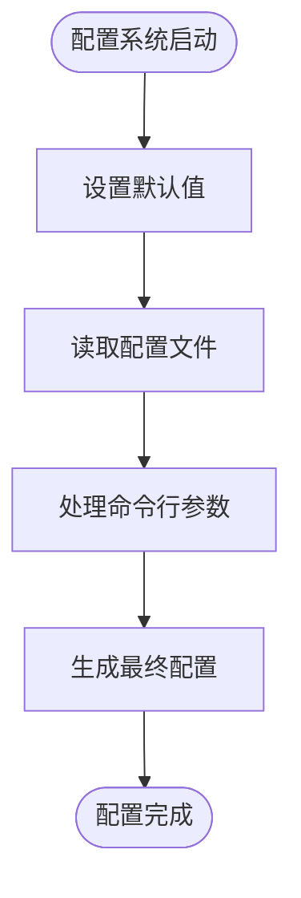
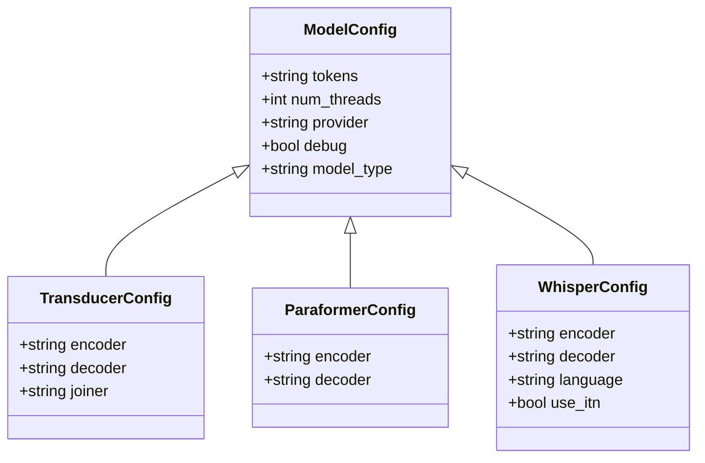
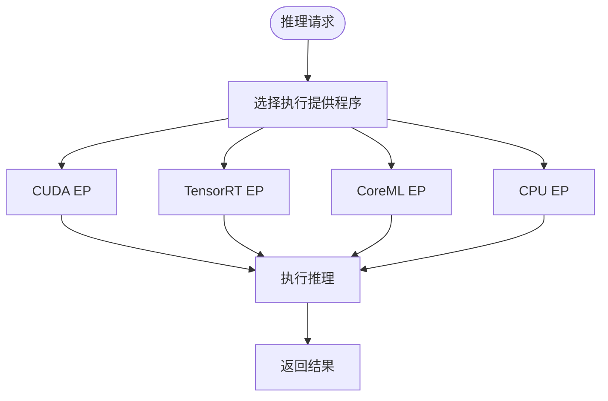
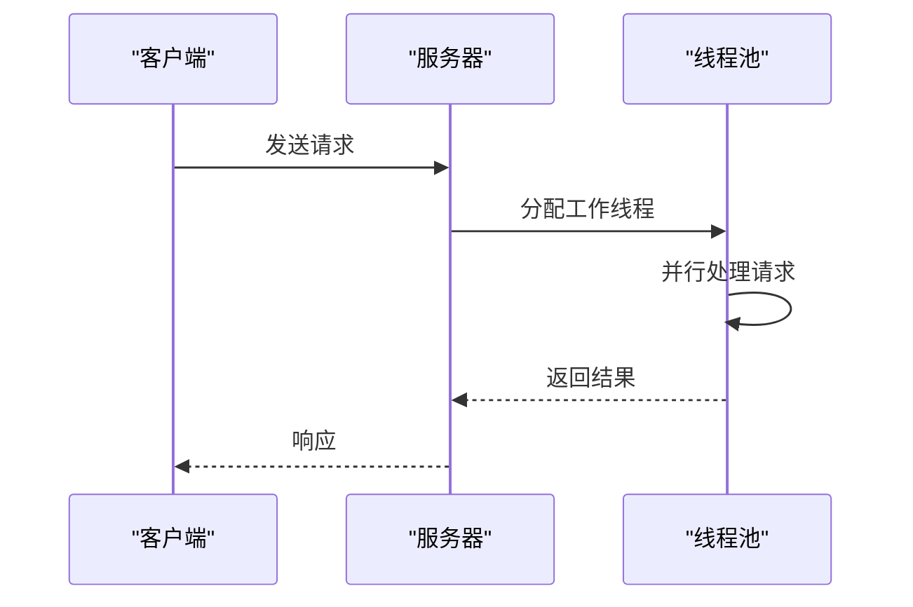
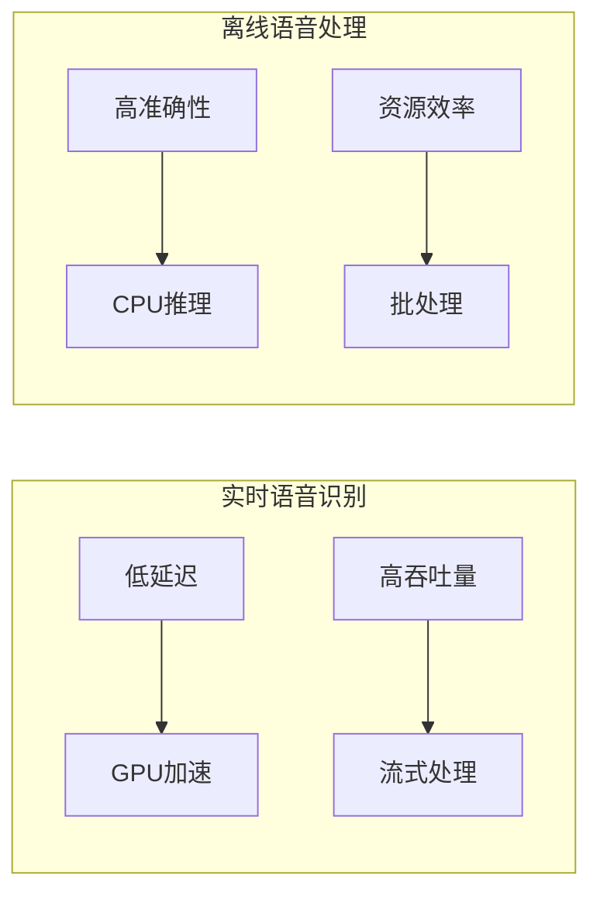
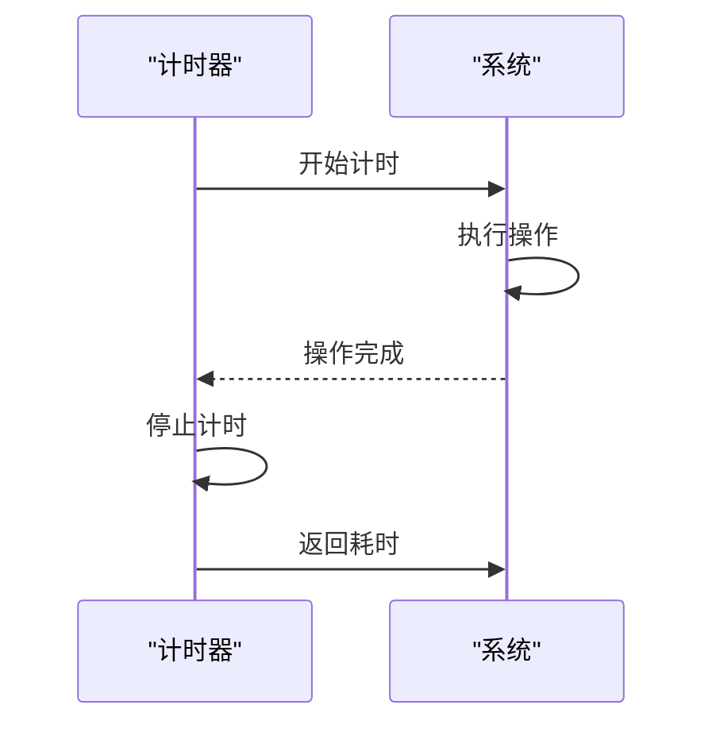
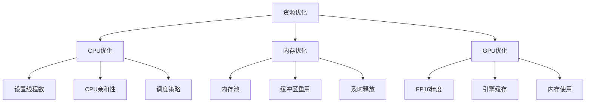

# 配置与优化

<cite>
**本文档引用的文件**   
- [provider-config.cc](file://sherpa-onnx/csrc/provider-config.cc)
- [parse-options.h](file://sherpa-onnx/csrc/parse-options.h)
- [parse-options.cc](file://sherpa-onnx/csrc/parse-options.cc)
- [session.cc](file://sherpa-onnx/csrc/session.cc)
- [timer.h](file://sherpa-onnx/csrc/timer.h)
- [timer.cc](file://sherpa-onnx/csrc/timer.cc)
- [generate_config.py](file://scripts/qnn/generate_config.py)
- [add-metadata.py](file://scripts/tele-speech/add-metadata.py)
- [offline-tts-c-api.c](file://c-api-examples/offline-tts-c-api.c)
- [non_streaming_server.py](file://python-api-examples/non_streaming_server.py)
- [streaming-zipformer-rtf-cxx-api.cc](file://cxx-api-examples/streaming-zipformer-rtf-cxx-api.cc)
- [OfflineSpeakerDiarization.ets](file://harmony-os/SherpaOnnxHar/sherpa_onnx/src/main/ets/components/NonStreamingSpeakerDiarization.ets)
- [AsrWebsocketServer.java](file://java-api-examples/src/websocketsrv/AsrWebsocketServer.java)
- [sherpa-onnx-wasm-main-speaker-diarization.cc](file://wasm/speaker-diarization/sherpa-onnx-wasm-main-speaker-diarization.cc)
- [export-onnx.py](file://scripts/whisper/export-onnx.py)
- [test_audio_tagging_ced.js](file://nodejs-addon-examples/test_audio_tagging_ced.js)
- [offline-parallel.cc](file://sherpa-onnx/csrc/sherpa-onnx-offline-parallel.cc)
- [qnn-model.cc](file://sherpa-onnx/csrc/qnn/qnn-model.cc)
- [utils.cc](file://sherpa-onnx/csrc/qnn/utils.cc)
- [offline_recognizer.dart](file://flutter/sherpa_onnx/lib/src/offline_recognizer.dart)
- [cxx-api.cc](file://sherpa-onnx/c-api/cxx-api.cc)
</cite>

## 目录
1. [配置系统概述](#配置系统概述)
2. [API参数调整](#api参数调整)
3. [性能优化策略](#性能优化策略)
4. [应用场景配置建议](#应用场景配置建议)
5. [自动化配置脚本](#自动化配置脚本)
6. [性能监控与调优工具](#性能监控与调优工具)
7. [资源使用优化指南](#资源使用优化指南)

## 配置系统概述

sherpa-onnx提供了一套完整的配置系统，允许用户通过配置文件和API参数调整系统行为。配置系统基于`ParseOptions`类实现，支持命令行参数、配置文件和程序内设置三种方式。

配置文件遵循特定格式，每行以`--`开头，后跟参数名和值，例如`--num-threads=4`。系统首先读取默认值，然后应用配置文件中的设置，最后处理命令行参数，形成最终的配置。配置文件支持注释，使用`#`符号标记。



**图源**
- [parse-options.h](file://sherpa-onnx/csrc/parse-options.h#L87-L118)
- [parse-options.cc](file://sherpa-onnx/csrc/parse-options.cc#L447-L489)

**本节源**
- [parse-options.h](file://sherpa-onnx/csrc/parse-options.h#L87-L259)
- [parse-options.cc](file://sherpa-onnx/csrc/parse-options.cc#L447-L489)

## API参数调整

sherpa-onnx通过API参数提供细粒度的系统行为控制。主要参数包括模型配置、特征提取配置、推理配置等。参数可以通过构造函数、setter方法或配置对象进行设置。

对于不同模型类型，配置参数有所不同。例如，Transducer模型需要指定编码器、解码器和连接器的路径，而Paraformer模型只需要指定模型路径。所有配置参数都经过类型安全检查，确保配置的有效性。



**图源**
- [cxx-api.cc](file://sherpa-onnx/c-api/cxx-api.cc#L57-L257)
- [offline_recognizer.dart](file://flutter/sherpa_onnx/lib/src/offline_recognizer.dart#L471-L498)

**本节源**
- [provider-config.cc](file://sherpa-onnx/csrc/provider-config.cc#L106-L144)
- [cxx-api.cc](file://sherpa-onnx/c-api/cxx-api.cc#L57-L257)

## 性能优化策略

sherpa-onnx提供多种性能优化策略，包括模型量化、推理加速、内存优化和多线程处理。这些策略可以显著提升系统性能，降低资源消耗。

### 模型量化

模型量化是通过降低模型权重的精度来减少模型大小和计算复杂度的技术。sherpa-onnx支持动态量化，可以将模型权重从FP32转换为INT8，从而减少内存占用和提高推理速度。

```python
from onnxruntime.quantization import quantize_dynamic, QuantType

# 量化模型
quantize_dynamic(
    model_input="model.onnx",
    model_output="model.int8.onnx",
    op_types_to_quantize=["MatMul"],
    weight_type=QuantType.QInt8,
)
```

### 推理加速

推理加速通过使用硬件加速器和优化的执行提供程序来提高推理速度。sherpa-onnx支持多种执行提供程序，包括CUDA、TensorRT和CoreML。



**图源**
- [provider-config.cc](file://sherpa-onnx/csrc/provider-config.cc#L40-L61)
- [session.cc](file://sherpa-onnx/csrc/session.cc#L259-L284)

### 内存优化

内存优化通过减少内存分配和重用内存缓冲区来降低内存消耗。sherpa-onnx使用内存池技术，避免频繁的内存分配和释放操作。

### 多线程处理

多线程处理通过并行执行多个任务来提高系统吞吐量。sherpa-onnx支持多线程推理，可以同时处理多个音频流。



**图源**
- [AsrWebsocketServer.java](file://java-api-examples/src/websocketsrv/AsrWebsocketServer.java#L163-L182)
- [offline-parallel.cc](file://sherpa-onnx/csrc/sherpa-onnx-offline-parallel.cc#L136-L179)

**本节源**
- [add-metadata.py](file://scripts/tele-speech/add-metadata.py#L54-L74)
- [provider-config.cc](file://sherpa-onnx/csrc/provider-config.cc#L40-L61)
- [session.cc](file://sherpa-onnx/csrc/session.cc#L259-L284)

## 应用场景配置建议

不同应用场景对系统性能和资源消耗有不同的要求。以下是针对实时语音识别和离线语音处理的配置建议。

### 实时语音识别

实时语音识别要求低延迟和高吞吐量。建议配置如下：

- 使用GPU加速（CUDA或TensorRT）
- 设置较小的批处理大小
- 启用流式处理
- 优化音频输入缓冲区大小

### 离线语音处理

离线语音处理更注重准确性和资源效率。建议配置如下：

- 使用CPU进行推理
- 设置较大的批处理大小
- 启用批处理模式
- 优化内存使用



**图源**
- [non_streaming_server.py](file://python-api-examples/non_streaming_server.py#L550-L595)
- [OfflineSpeakerDiarization.ets](file://harmony-os/SherpaOnnxHar/sherpa_onnx/src/main/ets/components/NonStreamingSpeakerDiarization.ets#L44-L84)

**本节源**
- [non_streaming_server.py](file://python-api-examples/non_streaming_server.py#L550-L595)
- [OfflineSpeakerDiarization.ets](file://harmony-os/SherpaOnnxHar/sherpa_onnx/src/main/ets/components/NonStreamingSpeakerDiarization.ets#L44-L84)

## 自动化配置脚本

sherpa-onnx提供了一系列自动化配置脚本，用于简化配置过程。这些脚本可以自动生成配置文件、优化模型和部署系统。

### QNN配置生成

QNN配置生成脚本用于为高通神经网络处理器生成配置文件。脚本根据指定的SoC型号和模型名称生成HTP配置文件。

```python
def generate_config(soc_name, graph_name, output_dir, qnn_sdk_root):
    # 生成HTP后端扩展配置
    htp_backend_extensions_data = {
        "backend_extensions": {
            "shared_library_path": f"{qnn_sdk_root}/lib/x86_64-linux-clang/libQnnHtpNetRunExtensions.so",
            "config_file_path": f"{output_dir}/htp_config.json",
        }
    }
    
    # 生成HTP后端配置
    htp_backend_config_data = {
        "graphs": [
            {
                "vtcm_mb": soc.info.vtcm_size_in_mb,
                "O": 3,
                "graph_names": [graph_name],
            }
        ],
        "devices": [
            {
                "device_id": 0,
                "soc_id": soc.model.value,
                "dsp_arch": soc.info.arch.name,
                "cores": [
                    {
                        "core_id": 0,
                        "perf_profile": "burst",
                        "rpc_control_latency": 200,
                    }
                ],
            }
        ],
    }
    
    # 写入配置文件
    with open(str(output_dir / "htp_backend_extensions.json"), "w") as f:
        json.dump(htp_backend_extensions_data, f, indent=4)
        
    with open(str(output_dir / "htp_config.json"), "w") as f:
        json.dump(htp_backend_config_data, f, indent=4)
```

### 模型元数据添加

模型元数据添加脚本用于向ONNX模型添加元数据，包括模型版本、作者、许可证等信息。

```python
def add_meta_data(filename: str, meta_data: Dict[str, Any]):
    """向ONNX模型添加元数据"""
    model = onnx.load(filename)
    
    # 清除现有元数据
    while len(model.metadata_props):
        model.metadata_props.pop()
        
    # 添加新元数据
    for key, value in meta_data.items():
        meta = model.metadata_props.add()
        meta.key = key
        meta.value = str(value)
```

**本节源**
- [generate_config.py](file://scripts/qnn/generate_config.py#L59-L107)
- [export-onnx.py](file://scripts/whisper/export-onnx.py#L62-L79)

## 性能监控与调优工具

sherpa-onnx提供性能监控和调优工具，帮助用户分析系统性能和优化配置。

### 性能监控

性能监控工具通过计时器测量关键操作的执行时间，包括模型加载、推理和后处理。计时结果可以用于计算实时因子（RTF）和识别性能瓶颈。



**图源**
- [timer.h](file://sherpa-onnx/csrc/timer.h#L1-L29)
- [timer.cc](file://sherpa-onnx/csrc/timer.cc#L1-L42)

### 性能调优

性能调优工具提供详细的性能分析报告，包括CPU使用率、内存消耗和GPU利用率。这些信息可以用于优化系统配置和资源分配。

```python
# 性能分析示例
print(f"波形时长: {duration:.3f} 秒")
print(f"耗时: {elapsed_seconds:.3f} 秒")
print(f"RTF = {elapsed_seconds:.3f}/{duration:.3f} = {real_time_factor:.3f}")
```

**本节源**
- [timer.h](file://sherpa-onnx/csrc/timer.h#L1-L29)
- [timer.cc](file://sherpa-onnx/csrc/timer.cc#L1-L42)
- [test_audio_tagging_ced.js](file://nodejs-addon-examples/test_audio_tagging_ced.js#L52-L63)
- [streaming-zipformer-rtf-cxx-api.cc](file://cxx-api-examples/streaming-zipformer-rtf-cxx-api.cc#L121-L132)

## 资源使用优化指南

资源使用优化指南提供CPU、内存和GPU的优化建议，帮助用户在不同硬件环境下最大化系统性能。

### CPU优化

CPU优化建议包括：
- 设置合适的线程数（通常等于CPU核心数）
- 使用CPU亲和性绑定线程到特定核心
- 优化CPU调度策略

### 内存优化

内存优化建议包括：
- 使用内存池减少内存分配开销
- 重用缓冲区避免重复分配
- 及时释放不再使用的内存

### GPU优化

GPU优化建议包括：
- 启用FP16精度计算
- 使用TensorRT引擎缓存
- 优化GPU内存使用



**图源**
- [provider-config.cc](file://sherpa-onnx/csrc/provider-config.cc#L40-L61)
- [session.cc](file://sherpa-onnx/csrc/session.cc#L259-L284)
- [qnn-model.cc](file://sherpa-onnx/csrc/qnn/qnn-model.cc#L379-L466)
- [utils.cc](file://sherpa-onnx/csrc/qnn/utils.cc#L42-L283)

**本节源**
- [provider-config.cc](file://sherpa-onnx/csrc/provider-config.cc#L40-L61)
- [session.cc](file://sherpa-onnx/csrc/session.cc#L259-L284)
- [qnn-model.cc](file://sherpa-onnx/csrc/qnn/qnn-model.cc#L379-L466)
- [utils.cc](file://sherpa-onnx/csrc/qnn/utils.cc#L42-L283)