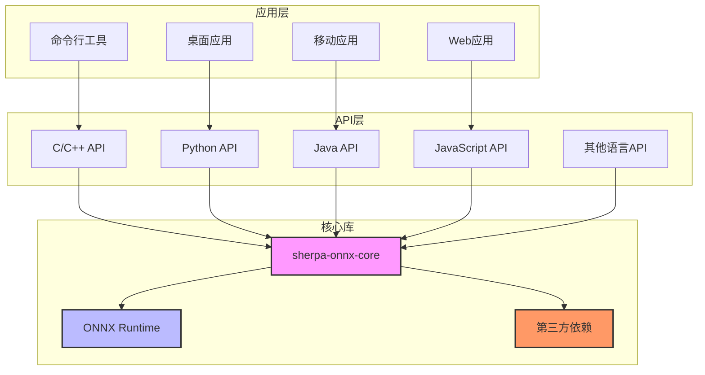

# 项目概述

<cite>
**本文档引用的文件**
- [README.md](file://README.md)
- [sherpa-onnx/CMakeLists.txt](file://sherpa-onnx/CMakeLists.txt)
- [sherpa-onnx/csrc/CMakeLists.txt](file://sherpa-onnx/csrc/CMakeLists.txt)
- [sherpa-onnx/csrc/session.cc](file://sherpa-onnx/csrc/session.cc)
- [sherpa-onnx/csrc/voice-activity-detector.cc](file://sherpa-onnx/csrc/voice-activity-detector.cc)
- [sherpa-onnx/csrc/voice-activity-detector.h](file://sherpa-onnx/csrc/voice-activity-detector.h)
- [sherpa-onnx/csrc/onnx-utils.cc](file://sherpa-onnx/csrc/onnx-utils.cc)
</cite>

## 目录
1. [简介](#简介)
2. [核心功能](#核心功能)
3. [架构设计](#架构设计)
4. [技术优势](#技术优势)
5. [与其他系统的区别](#与其他系统的区别)
6. [适用场景](#适用场景)

## 简介

sherpa-onnx是一个功能强大的本地语音处理框架，旨在为开发者提供一个全面、高效且跨平台的语音处理解决方案。该项目支持在本地运行多种语音处理功能，包括语音识别（ASR）、语音合成（TTS）、说话人分离、说话人识别、语音活动检测（VAD）等。其设计目标是提供一个无需依赖云端服务即可实现高质量语音处理的工具集，适用于各种离线应用场景。

该项目基于ONNX Runtime构建，利用其高效的推理能力，支持在多种硬件平台和操作系统上运行，包括x86、ARM、RISC-V架构的CPU，以及Rockchip NPU、Qualcomm NPU、Ascend NPU等专用神经网络处理器。这种广泛的硬件支持使得sherpa-onnx能够适应从嵌入式设备到高性能服务器的各种计算环境。

**Section sources**
- [README.md](file://README.md#L61-L95)

## 核心功能

sherpa-onnx项目提供了丰富的语音处理功能，涵盖了语音交互的多个关键环节。这些功能可以分为以下几大类：

### 语音识别（ASR）
支持流式和非流式的语音识别，能够将语音信号转换为文本。项目支持多种ASR模型，包括基于Zipformer、Paraformer、Whisper等架构的模型，适用于不同语言和场景。流式ASR适用于实时语音转录，而非流式ASR则适用于对完整音频文件进行高精度转录。

### 语音合成（TTS）
提供高质量的文本到语音转换功能，支持多种TTS模型，如Kitten、Kokoro、Matcha等。这些模型能够生成自然流畅的语音，支持多语言和多说话人。TTS功能可以用于语音助手、有声读物、语音导航等应用场景。

### 说话人相关功能
- **说话人分离**：能够将混合音频中的不同说话人声音分离出来，适用于会议记录、电话录音等场景。
- **说话人识别**：通过分析语音特征，识别说话人的身份，可用于身份验证、个性化服务等。
- **说话人验证**：验证说话人身份的真实性，确保语音来源的可靠性。

### 其他语音处理功能
- **语音活动检测（VAD）**：检测音频流中的语音活动，区分语音和静音段落，常用于语音通信、语音唤醒等场景。
- **关键词检测（KWS）**：实时检测音频流中的特定关键词，适用于语音唤醒、命令识别等。
- **音频标签**：为音频片段添加语义标签，识别音频内容的类型或情感。
- **语音增强**：改善语音质量，去除背景噪声，提高语音清晰度。
- **源分离**：将混合音频中的不同声源（如人声、音乐、环境音）分离出来。

**Section sources**
- [README.md](file://README.md#L65-L75)

## 架构设计

sherpa-onnx的架构设计体现了模块化和可扩展性的原则，其核心组件通过清晰的层次结构组织，实现了功能的解耦和高效协作。

**Diagram sources**
- [sherpa-onnx/CMakeLists.txt](file://sherpa-onnx/CMakeLists.txt#L1-L13)
- [sherpa-onnx/csrc/CMakeLists.txt](file://sherpa-onnx/csrc/CMakeLists.txt#L300-L301)

### 核心组件
- **sherpa-onnx-core**：项目的核心库，实现了所有语音处理功能的底层算法和模型推理逻辑。该库以静态库形式编译，为上层API提供统一的接口。
- **ONNX Runtime**：作为深度学习模型的推理引擎，负责加载和执行ONNX格式的模型文件。它提供了跨平台的高性能推理能力，支持CPU、GPU和NPU等多种硬件加速。
- **第三方依赖**：包括kaldi-native-fbank、kaldi-decoder、sentencepiece等，用于实现语音特征提取、解码和文本处理等功能。

### API层
项目提供了丰富的API接口，支持多种编程语言，包括C++、C、Python、Java、JavaScript、Go、Swift等。这些API封装了核心库的功能，使开发者能够方便地在不同技术栈中集成语音处理能力。

### 应用层
基于API层，项目提供了多种应用形式，包括命令行工具、移动应用（Android、iOS）、Web应用和桌面应用。这些应用展示了如何在实际场景中使用sherpa-onnx的功能。

**Section sources**
- [sherpa-onnx/CMakeLists.txt](file://sherpa-onnx/CMakeLists.txt#L1-L13)
- [sherpa-onnx/csrc/CMakeLists.txt](file://sherpa-onnx/csrc/CMakeLists.txt#L300-L301)

## 技术优势

sherpa-onnx项目具有多项显著的技术优势，使其在语音处理领域脱颖而出。

### 跨平台兼容性
项目支持广泛的硬件架构和操作系统，包括x86、ARM、RISC-V等CPU架构，以及Rockchip、Qualcomm、Ascend等NPU。操作系统方面，支持Linux、macOS、Windows、Android、iOS、HarmonyOS等。这种跨平台兼容性使得sherpa-onnx能够适应各种计算环境，从嵌入式设备到云端服务器。

### 多语言API支持
通过提供C/C++、Python、Java、JavaScript等多种语言的API，sherpa-onnx降低了开发者集成语音处理功能的门槛。无论是系统级开发、Web开发还是移动应用开发，都能找到合适的API接口。

### ONNX Runtime集成
利用ONNX Runtime作为推理引擎，sherpa-onnx获得了高效的模型执行能力。ONNX Runtime支持多种硬件加速，能够充分利用CPU、GPU和NPU的计算资源，实现低延迟、高吞吐量的语音处理。

### 模块化设计
项目的模块化设计使得各个功能组件可以独立开发和维护，同时也便于功能扩展。开发者可以根据需要选择性地集成特定功能，而无需引入整个框架。

### 丰富的预训练模型
项目提供了大量预训练模型，覆盖多种语言和场景。这些模型经过优化，能够在保持高质量的同时实现快速推理，满足不同应用的需求。

**Section sources**
- [README.md](file://README.md#L20-L42)
- [sherpa-onnx/csrc/session.cc](file://sherpa-onnx/csrc/session.cc#L43-L200)

## 与其他系统的区别

与传统的语音处理系统相比，sherpa-onnx具有以下几个显著区别：

### 本地化处理
大多数语音处理系统依赖云端服务进行计算，而sherpa-onnx强调本地化处理。所有语音处理都在本地设备上完成，无需将音频数据上传到云端。这不仅提高了数据隐私和安全性，还减少了网络延迟，适用于对实时性和隐私要求较高的场景。

### 开源和可定制性
sherpa-onnx是一个完全开源的项目，代码和模型都公开可用。开发者可以自由地查看、修改和优化代码，根据特定需求进行定制。相比之下，许多商业语音处理系统是闭源的，定制性有限。

### 硬件适应性
项目特别注重对不同硬件平台的支持，尤其是对NPU的优化。这使得sherpa-onnx能够在资源受限的嵌入式设备上高效运行，而许多其他系统主要针对高性能服务器或通用CPU优化。

### 综合功能集
sherpa-onnx提供了一套完整的语音处理功能，涵盖了从语音识别到语音合成，再到说话人识别等多个方面。这种综合性的功能集使得开发者可以在一个框架内实现复杂的语音交互应用，而无需集成多个独立的系统。

**Section sources**
- [README.md](file://README.md#L20-L56)

## 适用场景

sherpa-onnx的多功能性和跨平台特性使其适用于多种应用场景：

### 智能设备
在智能音箱、智能手表等物联网设备中，sherpa-onnx可以提供本地化的语音助手功能，实现语音控制、语音问答等，同时保护用户隐私。

### 移动应用
在Android和iOS应用中，集成sherpa-onnx可以实现离线语音识别、语音合成等功能，提升用户体验，特别是在网络条件不佳的环境中。

### 企业应用
在企业级应用中，如会议记录系统、客服系统等，sherpa-onnx可以用于实时语音转录、说话人分离、语音情感分析等，提高工作效率。

### 边缘计算
在边缘计算场景中，sherpa-onnx可以在边缘设备上进行实时语音处理，减少对中心服务器的依赖，降低网络带宽需求。

### 教育和研究
由于其开源特性，sherpa-onnx是语音处理算法研究和教学的理想平台，研究人员和学生可以基于此框架进行算法改进和实验。

**Section sources**
- [README.md](file://README.md#L77-L95)